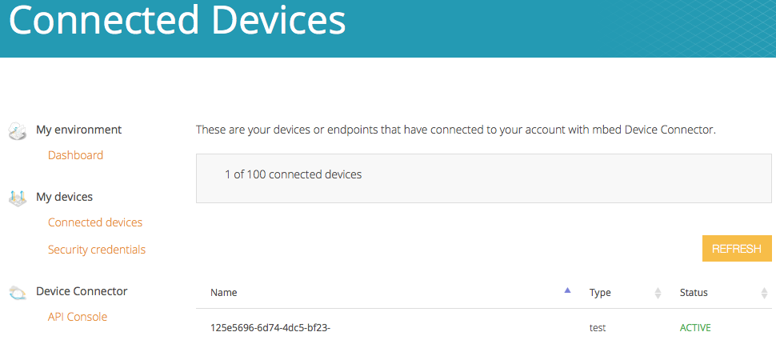

# Introduction

This reference deployment shows how to store and graph time series data coming from your mbed device.  By the end, you'll be able to see the number of button presses per hour coming from your mbed device.

# mbed Device Setup

The steps here will use the mbed web-compiler. This will load an operating system onto your mbed device so that it can upload data every time a button is pressed. This uses version pre-1.0 of mbed connector.

1. Login to [connector.mbed.com](https://connector.mbed.com), create an account if you need to.
1. Login to [developer.mbed.org](https://developer.mbed.org/) with the same account.
1. Physically connect and Ethernet cable and power cable to your board.
1. Visit [mbed-os-example-client](https://developer.mbed.org/teams/mbed-os-examples/code/mbed-os-example-client/).
1. Click the button "Import into Compiler" in the upper right.
1. A new browser window opens to the mbed web compiler. Click the "import" button to begin the import process.
1. Visit [connector.mbed.com](https://connector.mbed.com/#home)
1. Login and click the "Security credentials" link.
1. Click the "Get my device security credentials" button.
1. Select the text that displays, and copy it.
1. Go back to the mbed web compiler and click on the file `security.h`.
1. Delete the existing text and paste the text you copied.
1. Click the "Save" button near the top and the "Compile" button near the top.
1. After compilation succeeds a file is downloaded automatically: `mbed-os-example-client_K64F.bin`.
1. Drag-and-drop this file to the disk for your mbed device.
1. Once it's done copying the file (which takes a few seconds at most), restart the board.
1. Visit [your connected devices section of connector.mbed.com](https://connector.mbed.com/#endpoints) and you should see your device listed: 

Now that mbed Connector is configured, set up services on [Amazon](amazon.md).
