# Amazon Web Services

This tutorial sets up recording and displaying of time series data using Amazon Web Services (AWS).

Image of amazon data flow: 

ARM mbed connector will send data to Amazon Lambda. Then Amazon Lambda will then store a timestamp and entry into a database.  This database is queried by Amazon's QuickSight to display the data in a nice chart.

## 1. Setup IAM Role

Identity and Access Management (IAM) lets you set secure access for your various Amazon services.  Here you'll set up an IAM Role that allows Lambda to connect to the RDS VPC.

1. Go to the IAM service in the AWS console.
1. Click "Roles".
1. Click "Create new role".
1. Under "AWS Service Role" look for "AWS Lambda" and click the "Select" button. 
1. In the "Filter" field enter `AWSLambdaBasicExecutionRole` and click the checkbox.
1. Now in the "Filter" field enter `AWSLambdaVPCAccessExecutionRole` and click the checkbox.
1. Click "Next step".
1. In the "Role name" field enter `mbed_time_series_database`. 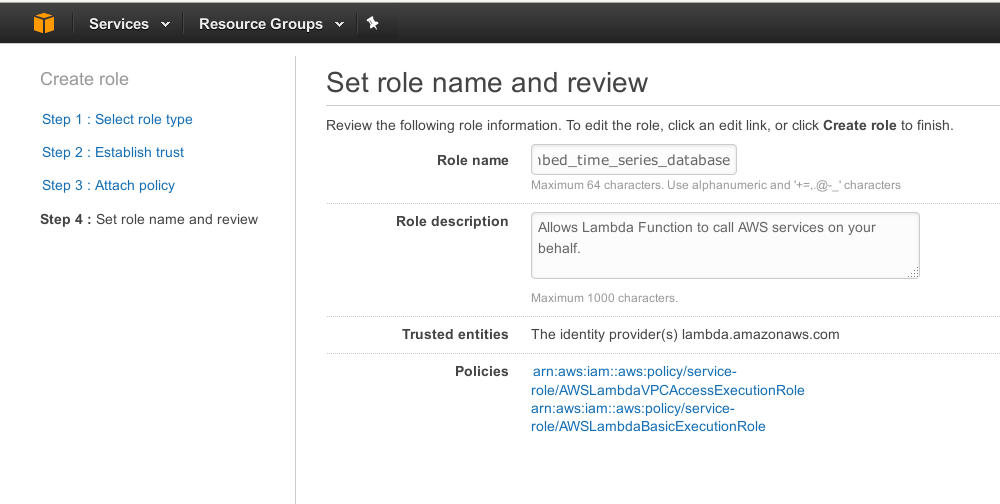
1. Click the "Create role" button.
1. The screen should display: 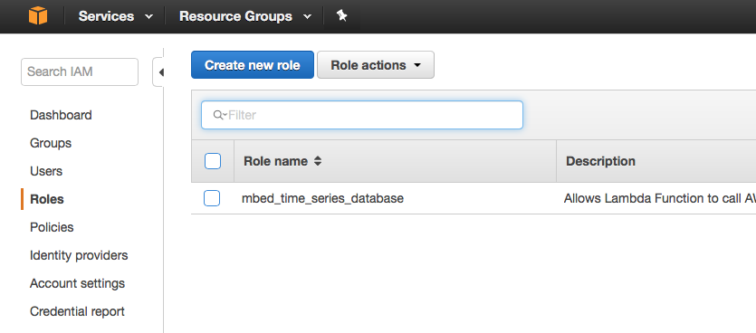

## 2. Create RDS database

RDS is the database that will hold the time series data.

1. In Amazon console, click "Services" and click "RDS"
1. Click "Get Started"
1. For "Amazon Aurora" click the "Select" button. (MySQL is equally compatible with these steps.)
1. Choose hardware for your database as you wish.
1. Specify settings: 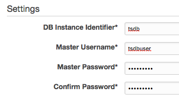
1. Click "Next Step"
1. Specify advanced details: 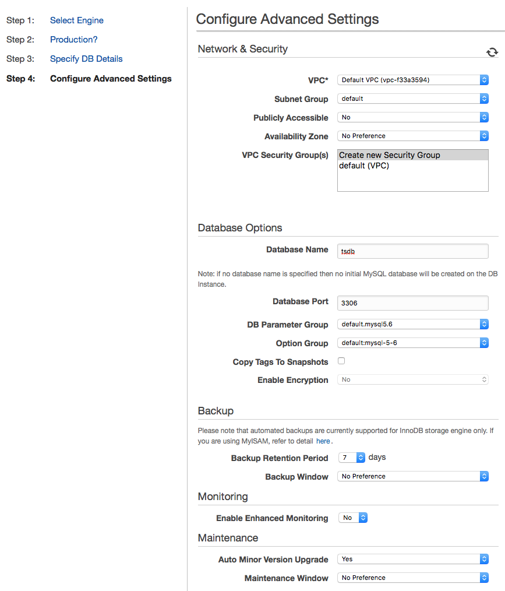
    * no-publicly-accessible
    * default VPC
    * database name: tsdb
    * remember the hostname (such as "tsdb.abcdefghi.us-west-2.rds.amazonaws.com")
1. Click the "Create" button.
1. After a few minutes your database is up and running: 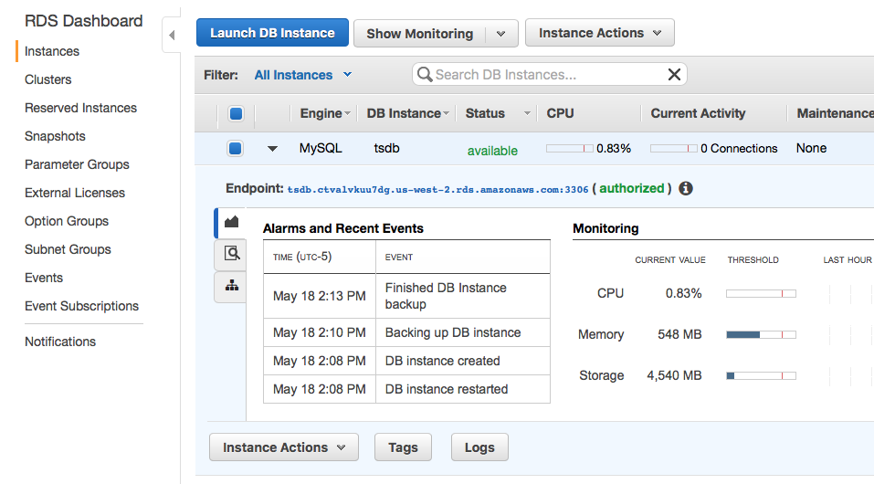
   
## 3. Authorize access to your database

AWS uses security groups to control access to some resources including RDS.
Here we set up security groups to allow access from your development machine's
IP.

### 3a. Create a security group to allow access to RDS from your Desktop

Authorize access to RDS from your computer using security groups [you can choose to read here for more information](http://docs.aws.amazon.com/AmazonRDS/latest/UserGuide/USER_WorkingWithSecurityGroups.html).

1. Find your own IP address [google link](https://www.google.com/search?q=my+ip+address).
1. In AWS EC2 Management console, click Security Groups under `NETWORK & SECURITY`
1. Click `Create Security Group`
    * Security group name: desktop-RDS-access
    * Description: A security group to access RDS from my desktop PC.
    * VPC: default
1. Click `Inbound` -> `Add Rule`
1. Enter information: 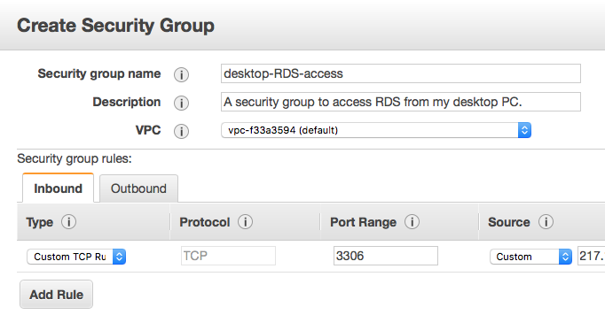
    * Type: Custom TCP Rule
    * Port Range: 3306
    * Source: Custom
    * CIDR: Your IP address/32, e.g. 203.0.113.1/32
        * Note that this only adds your one IP address to the access list.  If your IP address changes, you need to update this CIDR to match your new IP address.  Alternatively, if you know your IP address block, you can enter that here.
1. Click `Create`

### 3b. Add this security group to the security groups used by your RDS instance

1. Open your RDS instance in the AWS console.
1. Click "Actions" then click "Modify"
1. Ctrl+click (or cmd+click on Mac) the default security group, and the newly created security group 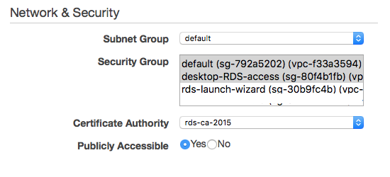
1. Check "Apply Immediately"
1. Click "Confirm" button.

## 4. Create the events table

Here you'll create the RDS schema for the data.

1. Download the [MySQL Shell](https://dev.mysql.com/downloads/shell/)
1. Create a configuration file named `rds.cnf`
   ```
   [client]
   host=<RDS instance endpoint hostname>
   port=3306
   user=tsdbuser
   password=<tsdb password>
   ```
1. In a terminal, run `mysql --defaults-file=rds.cnf` or on a mac: 
   ```
   mysqlsh --sql -h tsdb.ctvalvkuu7dg.us-west-2.rds.amazonaws.com -P 3306 -u tsdbuser -p
   ```
1. Including the semicolon at the end, type the command `use tsdb;`
    * output: `Database changed`
1. type ```create table `events` (`id` int(11) NOT NULL AUTO_INCREMENT, `ts` datetime NOT NULL, `value` double NOT NULL, `board` varchar(36) NOT NULL, `sensor` varchar(45) NOT NULL, PRIMARY KEY (`id`), KEY `ts` (`ts`), KEY `board` (`board`));```
    * output: `Query OK, 0 rows affected (0.09 sec)`
1. type `quit;`

## 5. Create the API Gateway Lambda function

Lambda connects the webhook API Gateway endpoint to the RDS database so when an
mbed notification is sent to the webhook, the data ends up in the database.

1. Clone this [this repo](https://github.com/ARMmbed/exd_mysql_lambda)
1. In the directory `exd_mysql_lambda` create a file named `mysqldb.cfg`
   ```
   [mysql]
   hostname: <RDS instance endpoint hostname>
   username: tsdbuser
   password: <RDS password>
   database: tsdb
   table: events
   ```
1. Type `make`
1. Go to the lambda service in the AWS console
1. In Lambda console, create a new lambda function
    * Runtime: Python 2.7
    * Template: Blank Function
    * Trigger: none (just click "Next")
    * Name: `mbed_time_series_webhook`
    * Code: upload a the .zip file from before
    * Handler: `mysql_lambda.webhook_handler`
1. In `Advanced Settings`, choose the VPC that RDS was created in, and add all the subnets.
1. `default` security group

**TODO**: add a screenshot here of the finished Lambda function screen

## 6. Configure the API Gateway

Here we set up the webhook API endpoint so that mbed connector will have a place
to send notifications.

1. Click "Services" in the upper-left to display a large menu of services. 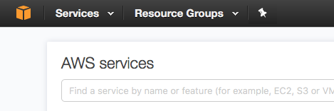
1. Click "API Gateway" listed under "Application Services". 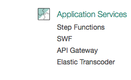
1. Click "Get Started", this will open a page to create a new API.
1. Select "New API" and for API name enter `mbed time series database webhook`. 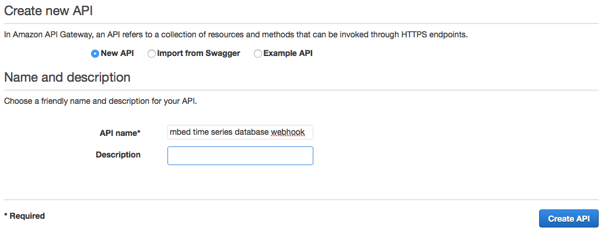
1. Click "Create API" button.
1. Click the "Actions" button and click "Create Resource". 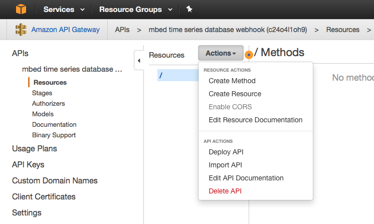
1. For "Resource Name" enter the text `webhook`.
1. Click the "Create Resource" button.
1. Click the "Actions" button and click "Create Method".
1. Select the "GET" method in the drop-down and click the check mark. 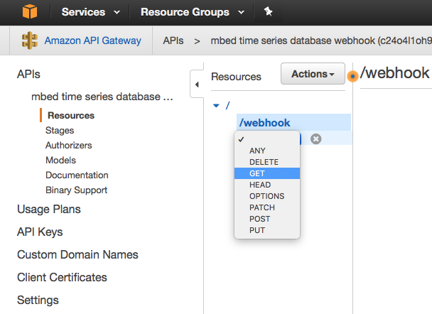
1. Under "Integration Type" select "Mock" and click "Save".
1. Create a PUT method 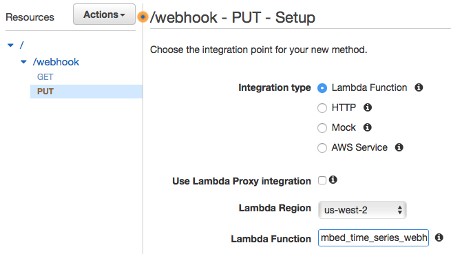
    * Integration type should be `Lambda`
    * Lambda function: `mbed_time_series_webhook`
1. Click on "Actions" and click on "Deploy API". 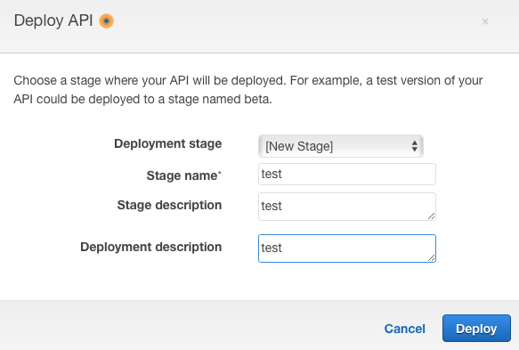
1. Click on `Stages` -> `webhook` -> `PUT` to see the URL to use as the webhook callback below. 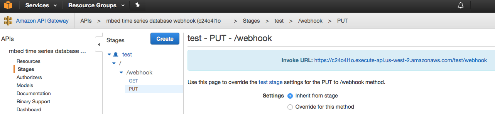


## 7. Register webhook callback

Here we tell mbed Connector to send notifications to our webhook.

1. Copy your [mbed Connector access key](https://connector.mbed.com/#accesskeys), which is a long string of letters: 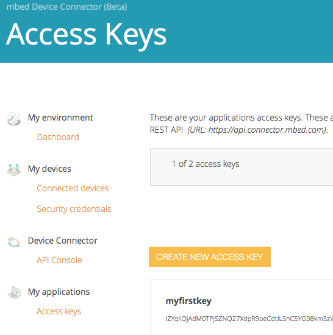
1. Also copy your [endpoint id](https://connector.mbed.com/#endpoints):
   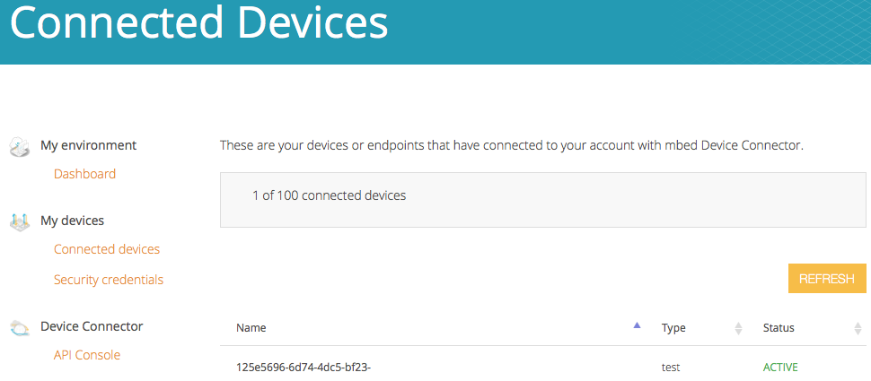
1. In the command below replace `yourmbedaccesskey` with your info, and run the command:

        curl -s -H "Authorization: Bearer yourmbedaccesskey" \
        -H "Content-Type: application/json" \
        --data '{"url": "https://myapidomain.amazonaws.com/test/webhook"}' \
        -X PUT "https://api.connector.mbed.com/v2/notification/callback"

1. In the command below, replace both `yourmbedaccesskey` and `yourendpointid` and run the command:

        curl -s -H "Authorization: Bearer yourmbedaccesskey" \
        -X PUT "https://api.connector.mbed.com/v2/subscriptions/yourendpointid/3200/0/5501/"


## 8. View data using QuickSight

Here we'll set up QuickSight to pull data from RDS and create a graph.

1. Sign up for [QuickSight](https://quicksight.aws/)
1. [Authorize](http://docs.aws.amazon.com/quicksight/latest/user/enabling-access-rds.html) connection from QuickSight to RDS
1. On the QuickSight main page click the name of your RDS Instance, "tsdb" in this case: 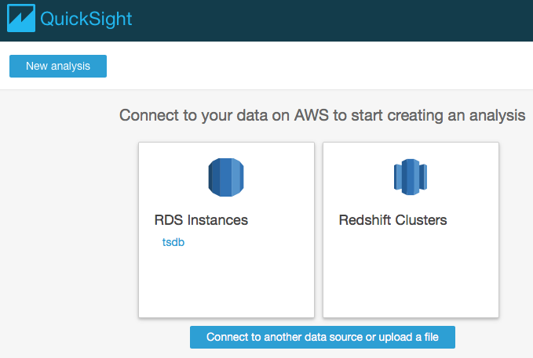
1. Enter the "username" and "password" for your RDS so that QuickSight may access it and click "Create data source". 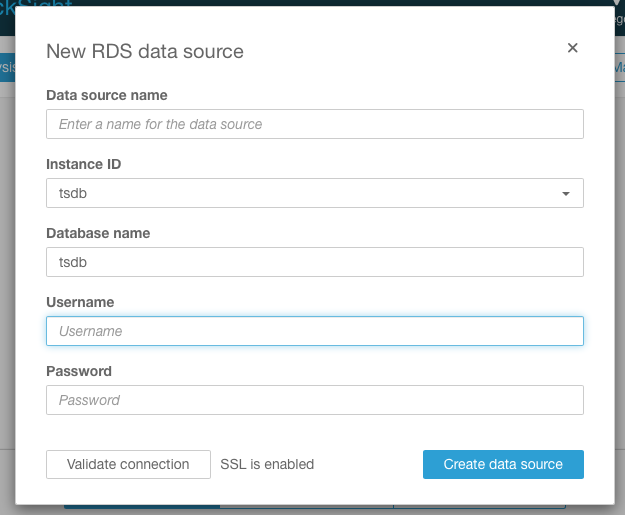
1. Select "events", then click on "select"
1. Select "Directly query your data", then click on "visualize"
1. highlight “date” and “value”
1. click the arrows next to “Field wells”
1. X axis dropdown, aggregate by hour

The final plot may look something like this:
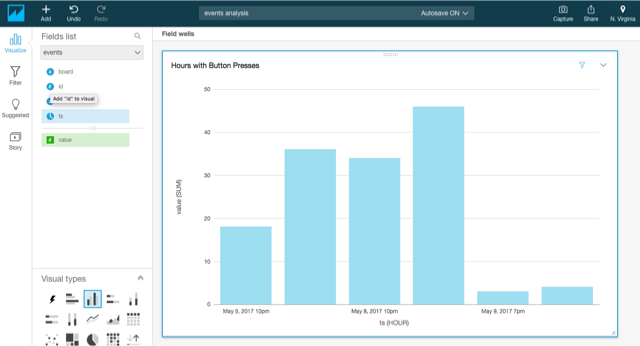
