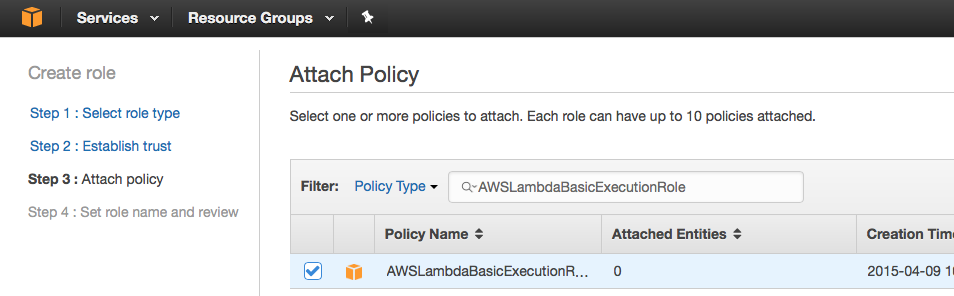

# Amazon Web Services

Here's how to get time series data into Amazon Web Services (AWS).

### Setup IAM Role

1. Go to the IAM service in the AWS console.
1. Click "Roles".
1. Click "Create new role".
1. Under "AWS Service Role" look for "AWS Lambda" and click the "Select" button. 
1. In the "Filter" field enter `AWSLambdaBasicExecutionRole` and click the checkbox. 
1. Now in the "Filter" field enter `AWSLambdaVPCAccessExecutionRole` and click the checkbox.
1. Click "Next step".
1. In the "Role name" field enter `mbed_time_series_database`.
1. Click the "Create role" button.
1. The screen should display: 

### Create RDS database

1. Make Aurora/MySQL on [RDS](https://aws.amazon.com/rds/)
   * no-publicly-accessible
   * default VPC
   * database name: tsdb
   * username: tsdbuser
   * remember the ip address, and password
1. Authorize access to RDS from your computer using security groups [more info](http://docs.aws.amazon.com/AmazonRDS/latest/UserGuide/USER_WorkingWithSecurityGroups.html).
   1. Find your own IP address.
      * `https://www.google.com/search?client=safari&rls=en&q=my+ip+address&ie=UTF-8&oe=UTF-8`
   1. In AWS EC2 Management console, click Security Groups under `NETWORK & SECURITY`
   1. Click `Create Security Group`
      * Security group name: desktop-RDS-access
      * Description: A security group to access RDS from my desktop PC.
      * VPC: default
   1. Click `Inbound` -> `Add Rule`
      * Type: Custom TCP Rule
      * Port Range: 3306
      * Source: Custom
      * CIDR: Your IP address/32, e.g. 203.0.113.1/32
        * Note that this only adds your one IP address to the access list.  If your IP address changes, you need to update this CIDR to match your new IP address.  Alternatively, if you know your IP address block, you can enter that here.
   1. Click `Create`

### Create the events table

1. Download the [MySQL Shell](https://dev.mysql.com/downloads/shell/)
1. Create a configuration file named `rds.cnf`
   ```
   [client]
   host=<ip address of RDS instance>
   port=3306
   user=tsdbuser
   password=<tsdb password>
   ```
1. In a terminal, run `mysql --defaults-file=rds.cnf`
1. type `use tsdb`
   * output: `Database changed`
1. type ```create table `test` (`id` int(11) NOT NULL AUTO_INCREMENT, `ts` datetime NOT NULL, `value` double NOT NULL, `board` varchar(36) NOT NULL, `sensor` varchar(45) NOT NULL, PRIMARY KEY (`id`), KEY `ts` (`ts`), KEY `board` (`board`));```
   * output: `Query OK, 0 rows affected (0.09 sec)`
1. type `quit`

### Create the API Gateway Lambda function

1. Go to the lambda service in the AWS console
1. Check out [this repo](https://github.com/ARMmbed/exd_mysql_lambda)
1. `cd exd_mysql_lambda`
1. Create a file named `mysqldb.cfg`
   ```
   [mysql]
   hostname: <ip address of RDS>
   username: tsdbuser
   password: <RDS password>
   database: tsdb
   table: events
   ```
1. ```make```
1. In Lambda console, create a new lambda function
    * Runtime: Python 2.7
    * Template: Blank Function
    * Trigger: none (just click "Next")
    * Name: `mbed_time_series_webhook`
    * Code: upload a the .zip file from before
1. In `Advanced Settings`, choose the VPC that RDS was created in, and add all the subnets.
1. `default` security group

**TODO**: add a screenshot here of the finished Lambda function screen

### Configure the API Gateway

1. Click "Services" in the upper-left to display a large menu of services. 
1. Click "API Gateway" listed under "Application Services". 
1. Click "Get Started", this will open a page to create a new API.
1. Select "New API" and for API name enter `mbed time series database webhook`. 
1. Click "Create API" button.
1. Click the "Actions" button and click "Create Resource". 
1. For "Resource Name" enter the text `webhook`.
1. Click the "Create Resource" button.
1. Click the "Actions" button and click "Create Method".
1. Select the "GET" method in the drop-down and click the check mark. 
1. Under "Integration Type" select "Mock" and click "Save".
1. Create a PUT method
    * Integration type should be `Lambda`
    * Lambda function: `mbed_time_series_webhook`
1. Click on `Stages` -> `webhook` -> `PUT` to see the URL to use as the webhook callback below.
1. [Configure the API Gateway](#)
1. [Create the API Gateway Lambda function](#)


**TODO**: Create a metric of securing the webhook(API keys?)

**TODO**: add a screenshot here of the finished API Gateway screen

### Register webhook callback

1. Register the webhook callback URL by running: `curl -s -H "Authorization: Bearer yourauthtoken" -H "Content-Type: application/json" -X PUT --data '{"url": "https://myapidomain.amazonaws.com/test/webhook"}' "https://api.connector.mbed.com/v2/notification/callback"` 
1. Subscribe to button presses by running: `curl -s -H "Authorization: Bearer yourauthtoken" -X PUT "https://api.connector.mbed.com/v2/subscriptions/yourendpointid/3200/0/5501/"`


### View data using QuickSight

1. Sign up for [QuickSight](https://quicksight.aws/)
1. [Authorize](http://docs.aws.amazon.com/quicksight/latest/user/enabling-access-rds.html) connection from QuickSight to RDS
1. In QuickSight, choose “New Analysis”
1. “New data set”
1. “RDS”
1. Choose Instance ID, database name, username, password, give it a data source name, 
1. “Create new data source”
1. “Edit data set”
1. “New field”
1. parseDate({timestamp}, “yyyy-MM-dd HH:mm:ss”)
1. name the new field ‘date"
1. “Save and Visualize”
1. highlight “date” and “value”
1. click the arrows next to “Field wells”
1. X axis dropdown, aggregate by hour
