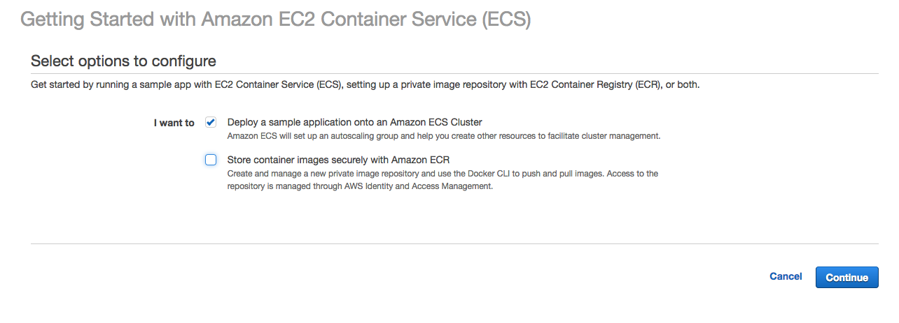
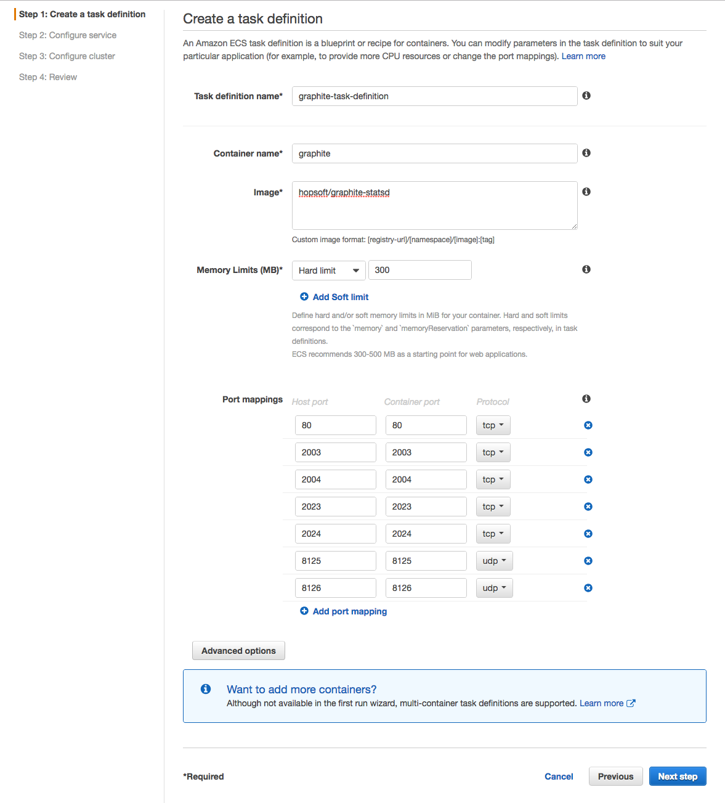
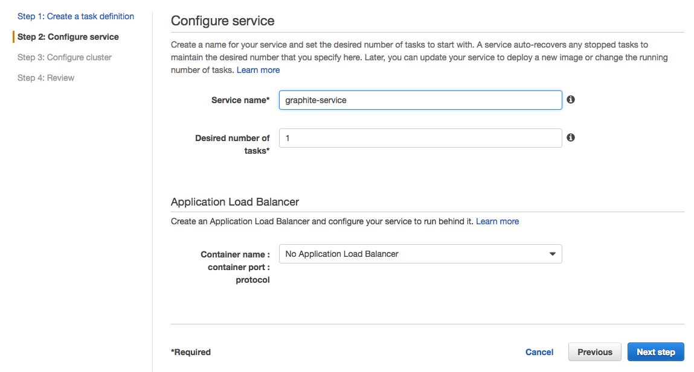
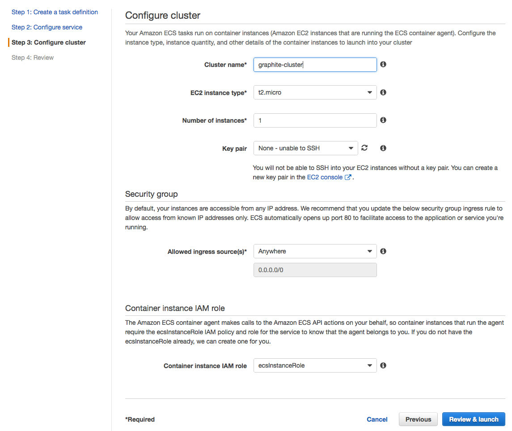
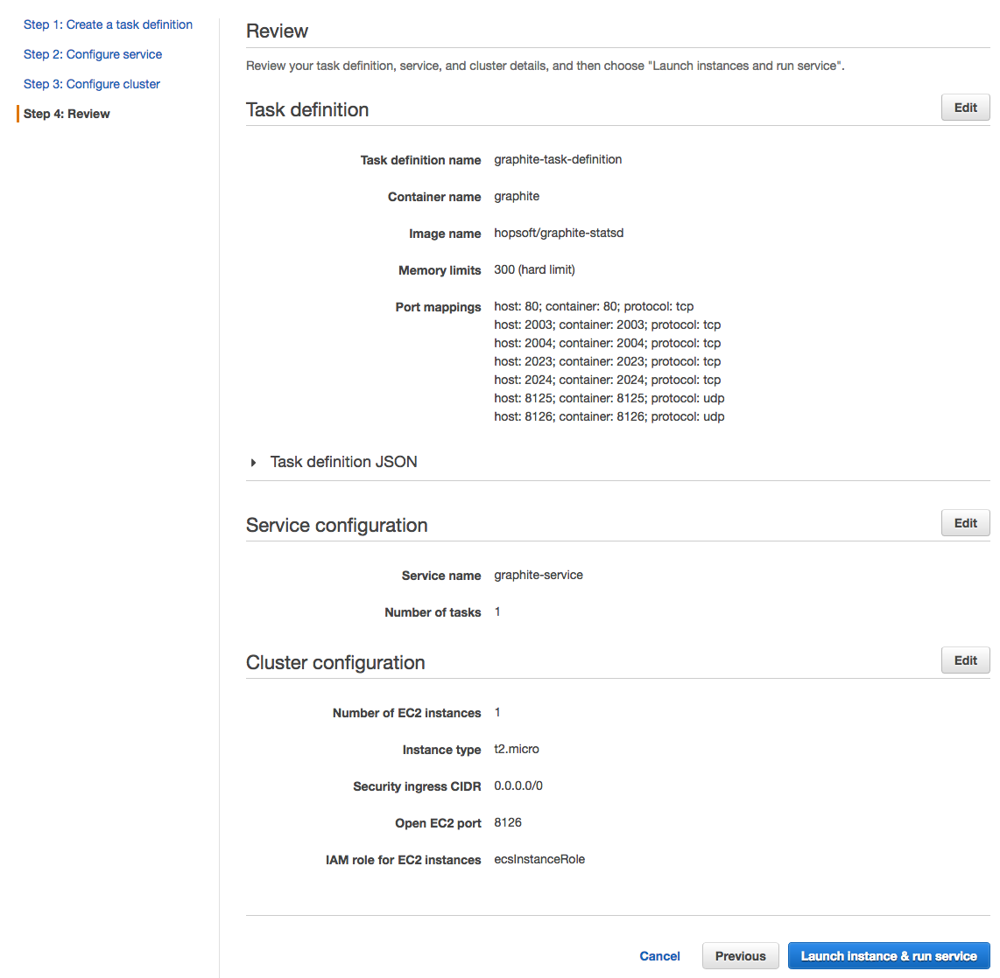
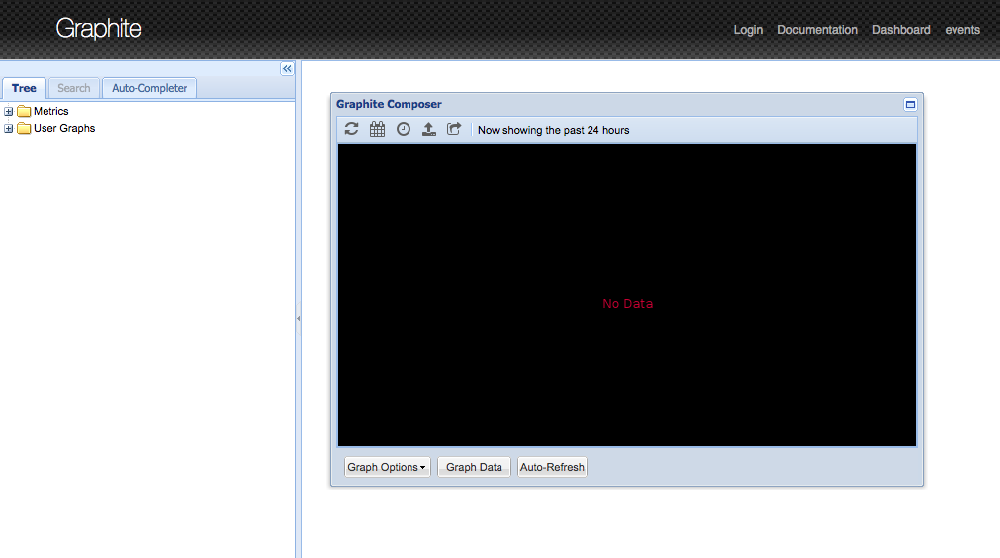

# Graphite

Here's how to get the time series data into the Graphite Time Series Database.

The conversion from mbed cloud data format to Graphite data format is done within an AWS Lambda / Gateway API data gateway.

## Preparing Your Environment

* Setup an AWS account.
* Create and test the [mbed client os example].  Make sure to keep the **AccessKey** token around.  It will be needed in the `Register Webhook` step.


## Setting up the Graphite Server

Creating a Graphite server is not a trivial task and the work has been done and packaged in a Docker image.  This image is hosted on Docker Hub and built from github [here][1].  This image will be run within the Amazon Elastic Container Service (AWS ECS).

1. On the first page of the ECS walk-through, there is a pair of checkboxes.  Select the 'Deploy a sample application onto an Amazon Cluster' and deselect 'Store container images securely with Amazon ECR', then press 'Continue'.  

1. Next, create a task definition.
On this form, specify a task name, an image name, the docker image location, and the ports to be used.  Once specified, click 'Next Step' to move to Configure Service.  

1. Now, configure a service.


1. Then, configure the cluster.


1. Finally, review and deploy.


1. (Optional) For a production environment, there are a number of steps to secure and customize the Graphite server.  Recommendations and instructions can be found on the [Docker Hub Page][1].

After all of the steps, you can verify that a Graphite service is up and running.  In order to find the DNS name of the Graphite service:

1. Open the ECS page within the AWS console.
1. Select 'grahite-cluster' in the list.
1. Select the 'ECS Instances' tab.
1. Click on the Container Instance, bringing up a description.
1. The 'Public DNS' is the name of the server.
1. Finally, browse to that DNS name.




## Create a Data Gateway

The conversion from mbed cloud data delived by webhook to a format consumable by the Graphite system is done with a combined Gateway API / Lambda system very similar to this same step in the RDS / Quicksight example.


### Create an Execution Role

The Gateway API / Lambda service needs to be able to get to and interact with the Graphite service that was just created.  In order to do that, these pieces will need to assume a role that has the appropriate permissions.

1. Go the IAM service in the AWS console.
1. Choose the Roles subsection (along the left border).
1. Click the `Create new Role` button.
1. On the `Select role type` page, under the `AWS Service Role` group, select `AWS Lambda`.
1. In the list of possible roles, find and select `AWSLambdaVPCAccessExecutionRole`, and then click `Next Step`.
1. Finally, name the role (i.e. `GraphiteLambdaRole`) and click `Create Role`.


### Create the Lambda function

1. Go to the Lambda service in the AWS console.
1. Check out [this repo][2].
1. `cd exd_graphite_lambda`
1. Create a file named `graphite.cfg`
   ```
   [graphite]
   hostname: <DNS of Graphite Server>
   port: 8125
   ```
1. `make`
1. In Lambda console, create a new lambda function
    * Runtime: Python 2.7
    * Template: Blank Function
    * Trigger: none (just click "Next")
    * Name: `mbed_time_series_webhook`
    * Code: upload the ZIP file created in the previous step.
1. In `Advanced Settings`, choose the VPC that Graphite Server was created in, and add all the subnets.
1. Select the role created earlier.
1. Choose the security group with the name similar to `EC2ContainerService-graphite-cluster-EcsSecurityGroup-XXXXXXXXXXXXXX`.  It was created as part of the Graphite cluster creation.
1. Click `Next`.
1. After reviewing the settings, click `Create Function`.


<!--- #### Test the Lambda Function --->


### Create the API Gateway

1. Go to the API Gateway service in the AWS console.  (It is under Application Services)
1. If this is the first API, you will be prompted with the banner page with a `Get Started` button.  If so, click it.  If you are subsequently given a dialog box, click `OK` to dismiss it.
1. If this is not your first API, click the `New API` button.
1. On the `Create new API` page, select the `New API` radio button, and name the API (i.e. `CaptureButtonPress`).  Then, click `Create API`.
1. On the `Resources` page of the new API, select `Create Resource` from the `Actions` button.
1. Add a name (i.e. `webhook`) and click `Create Resource`.
1. With `webhook` selected (under Resources), select `Create Method` from the `Actions` button.
1. Choose `PUT` from within the method selection, and click the neighboring check mark.
1. A setup page is presented.  Select `Lambda Function` if it is not already chosen.  Select the region where the Lambda function was defined.  Then enter the name of the Lambda function.  Finally, click `Save` and `Ok`.

<!--- #### Test the API Gateway --->


### Publish the API

In order for the API to be available to the public, it must be *deployed*.  Here is how to do that.

1. On the `Resources` page of the API defined above, select `Deploy API`.
1. Within the modal dialog box, in the drop down menu labelled `Deployment Stage`, select `[New Stage]`.
1. Choose a `Stage Name` (i.e. `test`) and enter it.  Finally click, `Deploy`.
1. At the top of the next page, there will be an `Invoke URL` that will be used in the `Register the Webhook` step.


### Register the Webhook

1. Register the webhook callback URL by running:

  ```
  curl -s -H "Authorization: Bearer yourauthtoken" \
        -H "Content-Type: application/json" \
        --data '{"url": "https://myapidomain.amazonaws.com/test/webhook"}' \
        -X PUT "https://api.connector.mbed.com/v2/notification/callback"
  ```

1. Subscribe to button presses by running:

  ```
  curl -s -H "Authorization: Bearer yourauthtoken" \
        -H "Content-Type: application/json" \
        --data '[{endpoint-name: "*", resource-path: ["/3200/0/5501"]}]' \
        -X PUT "https://api.connector.mbed.com/v2/subscriptions"
  ```

---
[mbed client os example]: https://github.com/ARMmbed/mbed-client-quickstart
[1]: https://hub.docker.com/r/hopsoft/graphite-statsd/
[2]: https://github.com/ARMmbed/exd_graphite_lambda
