# Microsoft Azure Setup

Microsoft offers a 30-day trial account with $200 to spend on Azure services during the trial period.

Subscribe link: https://azure.microsoft.com/en-us/services/time-series-insights/

**Data flow:**
Device --> mbed Cloud --> Microsoft Function (via webhook) --> Event Hub --> Event Source --> Time Series Insights
<!-- TODO: add diagram of data flow for Azure TSI -->

*Note*: Some of the steps below will take a minute or two to execute after you click **Create**. Wait until that's done before proceeding to the next step.

## 1. Create a Time Series Insights instance

<!-- TODO: short explanation of what each of these blocks is -->

In the Microsoft Azure left menu, click the **+** button, then go to **Internet of Things** -> **Time Series Insights**.

Any settings will work, but you'll probably want to create a new Resource Group and use it throughout the rest of this guide.

Next, add a data access policy:
in the Microsoft Azure left menu, click **All resources**, then go to your newly created Time Series Insights environment, select **Data Access Policies** and click the **+ Add** button on the top right.
Enter every user (by Microsoft account), including yourself, who has access to the Time Series (Contributor to add data and/or Reader to see the data).

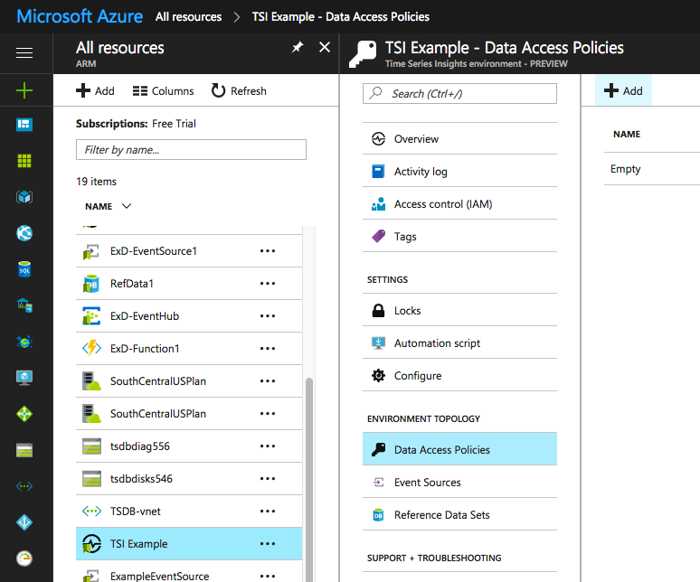

## 2. Create an Event Hub instance

In the Microsoft Azure left menu, click the **+** button, then go to **Internet of Things** -> **Event Hubs**. This will create an event hub namespace.

Again, any settings will work - make sure the pricing tier you pick offers the desired performance.

*Note: You will have to pick your own name for the event hub namespace, since this will be part of a public domain name and can't be a duplicate of an existing namespace.*

After clicking **Create**, go to **All resources** in the Azure menu on the left, select your event hub namespace, select **Event Hubs** and click **+ Event Hub**.

Enter a name for the event hub instance, e.g. _ExampleEventHub-1_. You can tweak any other settings before clicking **Create**.

## 3. Create an Event Source

In the Microsoft Azure left menu, click **All resources**, then go to your newly created Time Series Insights environment, select **Event Sources** and click the **+ Add** button on the top right.

Pick a name for the event source, and make sure it's in Event Hub mode and connected to the correct event hub instance.

*Notes*:
  * The default policy has all permissions. If that's too relaxed for you, you can set up additional policies before this step, in **All resources** -> _your event hub_ -> **Shared access policies**.
  * This example only uses one data reader, so it uses the default consumer group (there can only be one reader per consumer group). If you need more than one reader, you'll have to set up consumer groups before this step, and select one of them here.
  * The **Timestamp** field can be left blank unless you plan to supply your own timestamp for each data event.

## 4. Use Microsoft Functions to feed the Event Hub from mbed Cloud data events

<!-- TODO: number the steps -->

In the Microsoft Azure left menu, click the **+** button, then go to **Compute** -> **Function App**. Name your function and click Create.

*Note: You will have to pick your own name for the function app, since this will be part of a public domain name and can't be a duplicate of an existing function app.*

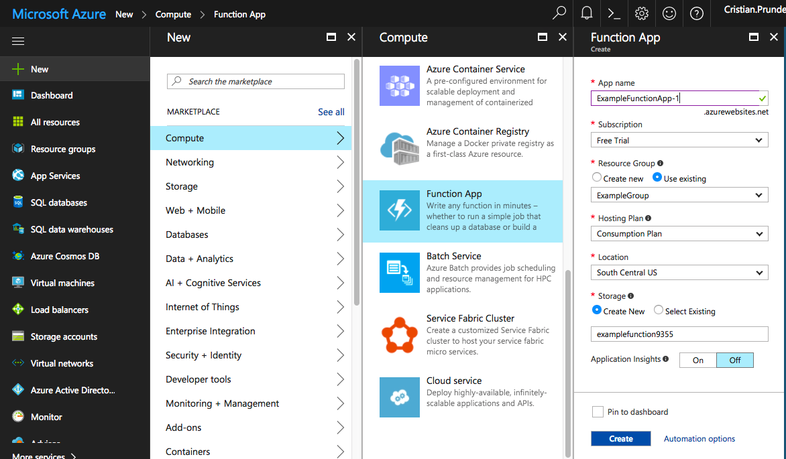

Next, retrieve the connection string for your event hub namespace. Go to **All resources** -> **_ExampleEventHub_** -> **Overview** -> **Connection Strings**.

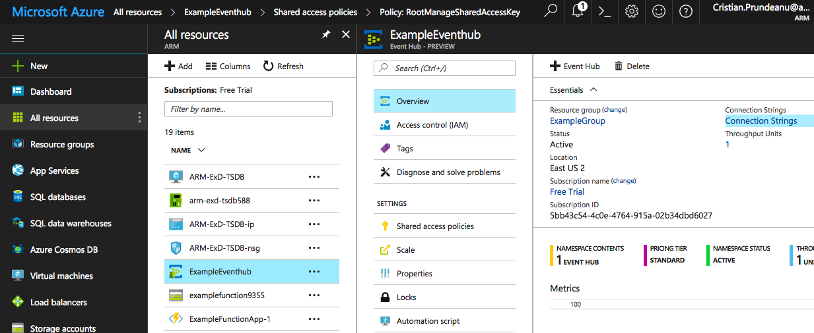

Select the policy you want to use (default: **_RootManageSharedAccessKey_**) and copy one of the connection strings for it.

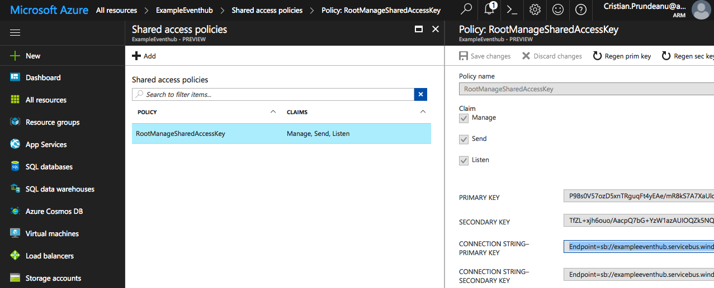

Now go back to your newly created function and add the connection string as an app setting.
You can find the relevant section under **All resources** -> **_ExampleFunctionApp-1_** -> **Platform features** -> **Application settings**.

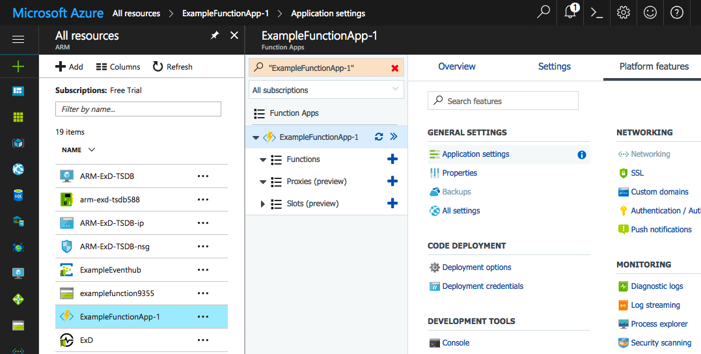

Add a new entry under **App settings** and name it HubConnectionString. As a value, paste the connection string you copied earlier.

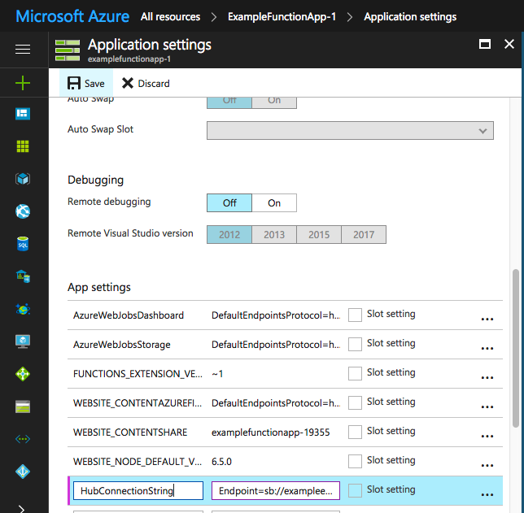

Let's connect the function to the event hub now. Go to **All resources** -> **_ExampleFunctionApp-1_** and click the green **+** button next to **Functions**.
Pick **Webhook + API** and your preferred language, then click **Create this function**.

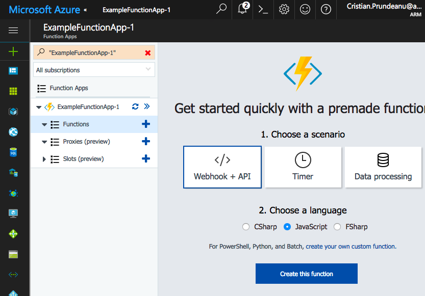

Then, under **Integrate**, click **New Output**, pick **Azure Event Hub**, and click **Select**.

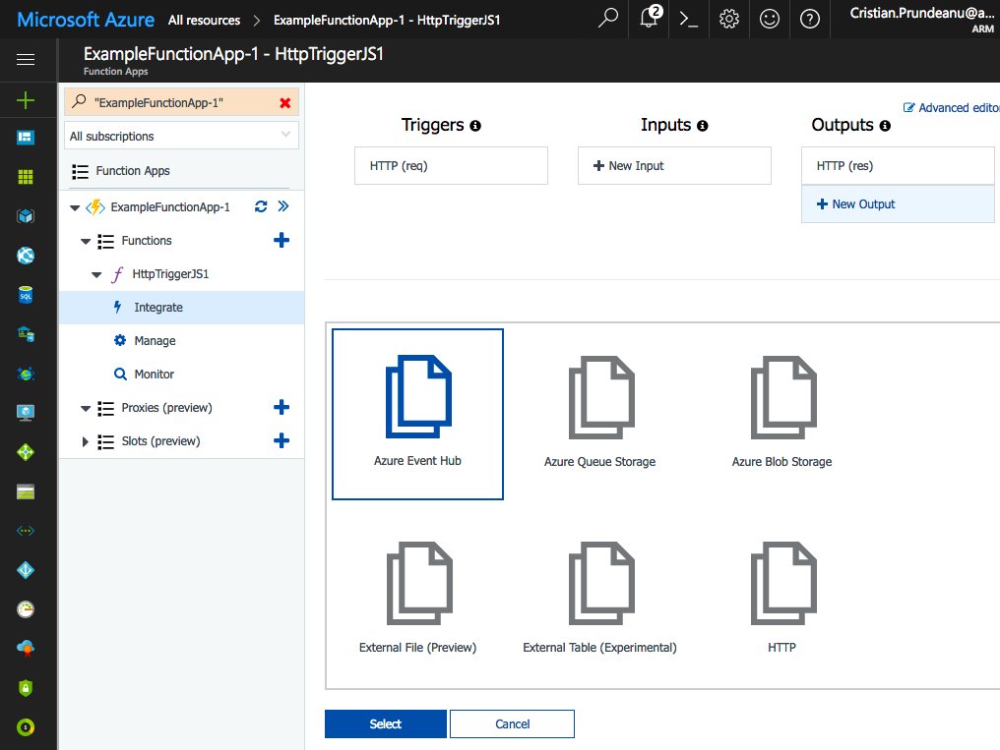

Make sure you specify the (lower case) name of the event hub instance under **Event hub name** - in our case, that's **_exampleeventhub-1_** - and check that the event hub connection lists the correct app setting (**_HubConnectionString_**); then click **Save**.

Lastly, go back to the function and type this code in:

    function atob(s) {
        var e = {}, i, k, v = [], r = '', w = String.fromCharCode;
        var n = [[65, 91], [97, 123], [48, 58], [43, 44], [47, 48]];
    
        for (z in n) {
            for (i = n[z][0]; i < n[z][1]; i++) {
                v.push(w(i));
            }
        }
        for (i = 0; i < 64; i++) {
            e[v[i]] = i;
        }
    
        for (i = 0; i < s.length; i+=72) {
            var b = 0, c, x, l = 0, o = s.substring(i, i+72);
            for (x = 0; x < o.length; x++) {
                c = e[o.charAt(x)];
                b = (b << 6) + c;
                l += 6;
                while (l >= 8) {
                    r += w((b >>> (l -= 8)) % 256);
                }
             }
        }
        return r;
    }
    
    module.exports = function (context, req) {
        if (req.body && req.body.notifications && req.body.notifications[0].payload) {
            context.bindings.outputEventHubMessage = atob(req.body.notifications[0].payload);
        }
    
        context.res = {
            status: 200,
            body: "OK"
        };
        context.done();
    };

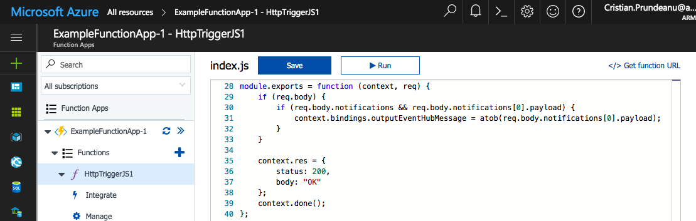

After typing the code in, click **</> Get function URL** and then **Copy**.
You can now let the mbed Cloud know where to call you back when new data is available.

Run this to register the webhook callback:

1. Register the webhook callback URL:

       MBED_ACCESS_KEY=your_mbed_access_key # get this from https://connector.mbed.com/#accesskeys
       AZURE_FUNCTION_URL=your_function_url # format:  https://examplefunctionapp-1.azurewebsites.net/api/HttpTriggerJS1?code=YourFunctionAccessCode==
       curl -s -H "Authorization: Bearer $MBED_ACCESS_KEY" -H "Content-Type: application/json" -X PUT "https://api.connector.mbed.com/notification/callback" --data '{"url": "'"$AZURE_FUNCTION_URL"'"}'

2. Subscribe to data updates:

       DEVICE_ID=your_device_id
       DEVICE_RESOURCE=alldata/0/json
       curl -s -H "Authorization: Bearer $MBED_ACCESS_KEY" -X PUT "https://api.connector.mbed.com/subscriptions/$DEVICE_ID/$DEVICE_RESOURCE/"

_(this assumes you are running the [mbed example client](http://github.com/CristianPrundeanuARM/exd-tsdb-mbed-client-connector) which sends data updates in JSON format)_.

3. Unsubscribe from data updates:

       curl -s -H "Authorization: Bearer $MBED_ACCESS_KEY" -X DELETE "https://api.connector.mbed.com/subscriptions/$DEVICE_ID/$DEVICE_RESOURCE/"

The data will be in JSON format:

   * for new data:

    { notifications: 
        [ { ep: 'your_device_id',
           path: '/alldata/0/json',
           ct: 'text/plain',
           payload: 'base64_encoded_payload=',
           'max-age': 0 } ] }

   * for registration updates:

    { 'reg-updates': 
       [ { ep: 'your_device_id',
           ept: 'test',
           resources: [Object containing exposed resources] } ] }

## 5. Visualize the data

In the Microsoft Azure left menu, click **All resources**, then go to your Time Series Insights environment's overview, and copy its access URL.

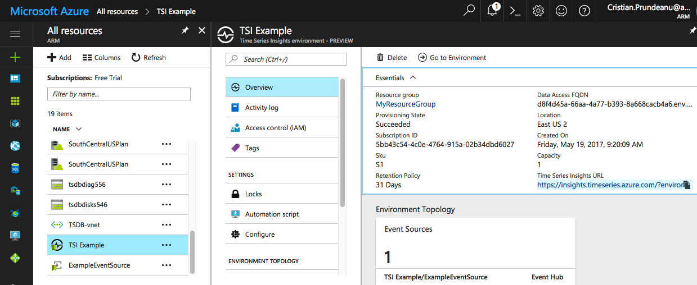

Finally, browse to the TSI instance's URL and configure your view of the data to suit your needs. The URL can be shared with anyone who is added to the TSI's data access policies as a Reader.

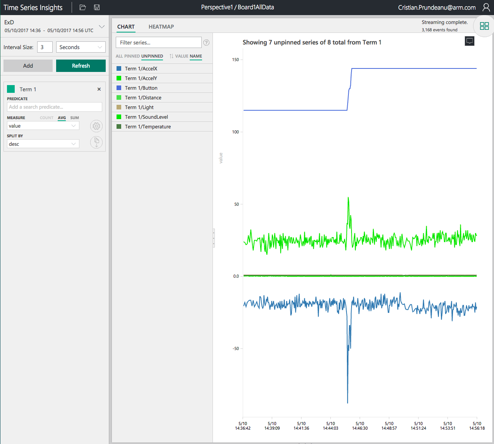

If you need to roll out your own analysis/visualization solution, an API is available to access the data. [Documentation for the API](https://docs.microsoft.com/en-us/rest/api/time-series-insights/time-series-insights-reference-queryapi) is maintained by Microsoft.

## Links

* [Time Series Insights: Sending events and JSON data format](https://docs.microsoft.com/en-us/azure/time-series-insights/time-series-insights-send-events)
* [Azure Functions JavaScript developer guide](https://docs.microsoft.com/en-us/azure/azure-functions/functions-reference-node)
* [Visualizing Time Series Insights data - sample and tutorial](https://insights.timeseries.azure.com/samples)
* [Time Series Insights data API](https://docs.microsoft.com/en-us/rest/api/time-series-insights/time-series-insights-reference-queryapi)
* [mbed Connector webhook](https://docs.mbed.com/docs/mbed-device-connector-web-interfaces/en/latest/api-reference/#registering-a-notification-callback)
