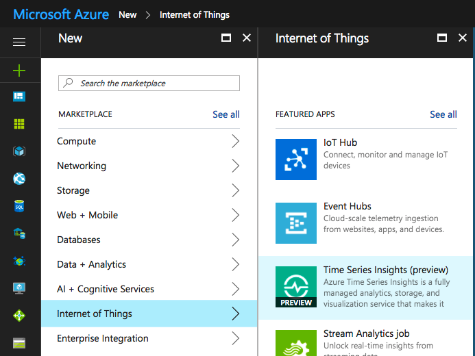

# Microsoft Azure Setup

Microsoft offers a 30-day trial account with $200 to spend on Azure services during the trial period.

Subscribe link: https://azure.microsoft.com/en-us/services/time-series-insights/

TODO: add diagram of data flow for Azure TSI

*Note*: Some of the steps below will take a minute or two to execute after you click **Create**. Wait until that's done before proceeding to the next step.

## 1. Create a Time Series Insights instance

In the Microsoft Azure left menu, click the **+** button, then go to **Internet of Things** -> **Time Series Insights**.

Any settings will work, but you'll probably want to create a new Resource Group and use it throughout the rest of this guide.

## 2. Create an Event Hub instance

In the Microsoft Azure left menu, click the **+** button, then go to **Internet of Things** -> **Event Hubs**.

Again, any settings will work - make sure the pricing tier you pick offers the desired performance.

After clicking **Create**, go to **All resources** in the Azure menu on the left, select your newly created event hub, select **Event Hubs** and click **+ Event Hub**.

Enter a name for the event hub instance, e.g. _ExampleEventHub-1_. You can tweak any other settings before clicking **Create**.

## 3. Create an Event Source

In the Microsoft Azure left menu, click **All resources**, then go to your newly created Time Series Insights environment, select **Event Sources** and click the **+ Add** button on the top right.

Pick a name for the event source, and make sure it's in Event Hub mode and connected to the correct event hub instance.

*Notes*:
  * The default policy has all permissions. If that's too relaxed for you, you can set up additional policies before this step, in **All resources** -> _your event hub_ -> **Shared access policies**.
  * This example only uses one data reader, so it uses the default consumer group (there can only be one reader per consumer group). If you need more than one reader, you'll have to set up consumer groups before this step, and select one of them here.
  * The **Timestamp** field can be left blank unless you plan to supply your own timestamp for each data event.

## 4. Feed the Event Hub from mbed Cloud data events

### 4a. Create a virtual machine and run a node.js server on it
 
### 4b. Use Microsoft Functions
