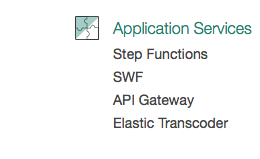

# Introduction

This reference deployment shows how to store and graph time series data coming from your mbed device.  By the end, you'll be able to see the number of button presses per hour coming from your mbed device.

It guides you through the following tasks:

**TODO**: fill out these explicit steps.  Maybe they're the same as below?

# mbed Device Setup

The steps here will use the mbed web-compiler. This will load an operating system onto your mbed device so that it can upload data every time a button is pressed. This uses version pre-1.0 of mbed connector.

1. Visit [mbed-os-example-client](https://developer.mbed.org/teams/mbed-os-examples/code/mbed-os-example-client/).
1. Click the button "Import into Compiler" in the upper right.
1. A new browser window opens to the mbed web compiler. Click the "import" button to begin the import process.
1. Visit [connector.mbed.com](https://connector.mbed.com/#home)
1. Login and click the "Security credentials" link.
1. Click the "Get my device security credentials" button.
1. Select the text that displays, and copy it.
1. Go back to the mbed web compiler and click on the file `security.h`.
1. Delete the existing text and paste the text you copied.
1. Click the "Save" button near the top and the "Compile" button near the top.
1. After compilation succeeds a file is downloaded automatically: `mbed-os-example-client_K64F.bin`.
1. Drag-and-drop this file to the disk for your mbed device.

Follow the [mbed-os-example-client](https://github.com/ARMmbed/mbed-os-example-client) to get data from a device into mbed Connector.

# Pick a Time Series Platform

**TODO**: flush out once we have more platforms than just Amazon.

# Microsoft Azure

**TODO**: finish me

# InfluxDB

**TODO**: finish me

# Google Cloud

**TODO**: finish me

# Graphite

**TODO**: finish me

# Amazon Web Services

Here's how to get time series data into Amazon Web Services (AWS).

## Configure the API Gateway


1. Click "Services" in the upper-left to display a large menu of services. 
1. Click "API Gateway" listed under "Application Services". 
1. Click "Get Started", this will open a page to create a new API.
1. Select "New API" and for API name enter `mbed time series database webhook`. 
1. Click "Create API" button.
1. Click the "Actions" button and click "Create Resource". 
1. For "Resource Name" enter the text `webhook`.
1. Click the "Create Resource" button.
1. Click the "Actions" button and click "Create Method".
1. Select the "GET" method in the drop-down and click the check mark. 
1. Under "Integration Type" select "Mock" and click "Save".
1. Create a PUT method
    * Integration type should be `Lambda`
    * Lambda function: `mbed_time_series_webhook`
1. Click on `Stages` -> `webhook` -> `PUT` to see the URL to use as the webhook callback below.

1. [Configure the API Gateway](#)
1. [Create the API Gateway Lambda function](#)


## Setup DynamoDB Table

1. Go to the DynamoDB service in the AWS console.
1. Click `Create Table`
    * Name: `mbed_connector_button_presses`
    * Primary Partition Key: Endpoint(String)
    * Add Sort Key: yes
    * Sort Key: EventHour(String)

Use the ARN of the DynamoDB table to create the IAM Role below.

**TODO**: add a screenshot here of the finished DynamoDB screen

## Setup IAM Role

1. Go to the IAM service in the AWS console
1. Click `Policies`
1. Click `Create a policy`
1. Click `Create Your Own Policy`
   * Policy Name: `AWSLambdaMicroserviceExecutionRole`
   * Policy Document:

    ```json
    {
        "Version": "2012-10-17",
        "Statement": [
            {
                "Effect": "Allow",
                "Action": [
                    "dynamodb:DeleteItem",
                    "dynamodb:GetItem",
                    "dynamodb:PutItem",
                    "dynamodb:Scan",
                    "dynamodb:UpdateItem"
                ],
                "Resource": "[your_dynamodb_arn]"
            }
        ]
    }
    ```
1. Create a new role called `mbed_time_series_database`
1. Attach the `AWSLambdaBasicExecutionRole` policy
1. Attach the `AWSLambdaMicroserviceExecutionRole` policy

**TODO**: add a screenshot here of the finished role screen

## Create the API Gateway Lambda function

1. Go to the lambda service in the AWS console
1. Create a new lambda function
    * Runtime: Python 2.7
    * Template: Blank Function
    * Trigger: none (just click "Next")
    * Name: `mbed_time_series_webhook`
    * Code:
 
    ```python
    from __future__ import print_function
    import datetime
    import json
    import base64
    
    import boto3
    
    
    default_dynamodb = boto3.resource(service_name='dynamodb',
                                      region_name='us-east-1')
    
    def update_dynamo_event_counter(tableName, endpoint, hour, event_count=1,
                                    dynamodb=default_dynamodb):
            table = dynamodb.Table(tableName)
            response = table.update_item(
            Key={
                'Endpoint': endpoint,
                'EventHour': hour,
            },
            ExpressionAttributeValues={":value":event_count},
            UpdateExpression="ADD EventCount :value")
    
    
    def lambda_handler(event, context):
        print("Received event: %r" % event)
        if 'notifications' in event:
            for notification in event['notifications']:
                if notification['path'] == '/3200/0/5501':
                        button_press_count = base64.b64decode(
                            notification['payload'])
                        print ('endpoint: %r button press count: %r' % (
                            notification['ep'], button_press_count))
                        now = datetime.datetime.now()
                        hour = str(now).split(':', 1)[0]+':00:00'
                        update_dynamo_event_counter(
                            'mbed_connector_button_presses',
                            notification['ep'], hour)
    ```
    * Existing Role: `mbed_time_series_database`

**TODO**: add a screenshot here of the finished Lambda function screen

 
**TODO**: Create a metric of securing the webhook(API keys?)

**TODO**: add a screenshot here of the finished API Gateway screen

## Register webhook callback

1. Register the webhook callback URL by running: `curl -s -H "Authorization: Bearer yourauthtoken" -H "Content-Type: application/json" -X PUT --data '{"url": "https://myapidomain.amazonaws.com/test/webhook"}' "https://api.connector.mbed.com/v2/notification/callback"` 
1. Subscribe to button presses by running: `curl -s -H "Authorization: Bearer yourauthtoken" -X PUT "https://api.connector.mbed.com/v2/subscriptions/yourendpointid/3200/0/5501/"`

## Create the DynamoDB Lambda function

1. Go to the lambda service in the AWS console
1. Create a new lambda function
    * Runtime: Python 2.7
    * Template: Blank Function
    * Trigger: none (just click "Next")
    * Name: `mbed_time_series_dynamodb`
    * Code:
 
    ```python
    import json
    import boto3
    from datetime import datetime
    from collections import defaultdict

    default_cwc = boto3.client('cloudwatch', region_name='us-east-1')
    
    def put_cloudwatch_metric(endpoint, hour, event_count=1, cwc=default_cwc):
        try:
            timestamp = datetime.strptime(hour, '%Y-%m-%d %H:%M:%S')
        except ValueError:
            return
        metricData=[{
                'MetricName': endpoint,
                'Timestamp': timestamp,
                'Value': event_count,
                'Unit': 'Count'
            },]
        response = cwc.put_metric_data(
	          Namespace="MbedButtonPressHour", MetricData=metricData)

    def lambda_handler(event, context):
        hour_event_counter = defaultdict(int)
        for record in event['Records']:
            try: endpoint = record['dynamodb']['NewImage']['Endpoint']['S']
            except Exception as e:
                endpoint='NULL'
            try: hour = record['dynamodb']['NewImage']['EventHour']['S']
            except Exception as e:
                hour='NULL'
            try:
                event_count_old=int(
                    record['dynamodb']['OldImage']['EventCount']['N'])
            except Exception as e:
                event_count_old=0
            try:
                event_count_new=int(
                    record['dynamodb']['NewImage']['EventCount']['N'])
            except Exception as e:
                event_count_new=0

            if endpoint != 'NULL' and hour != 'NULL':
                if(event_count_new > event_count_old):
                    counter_diff = event_count_new - event_count_old
                    hour_event_counter[(endpoint, hour)] += counter_diff

        for key,val in hour_event_counter.iteritems():
            print "%s, %s = %d" % (key[0], key[1], val)
            put_cloudwatch_metric(key[0], key[1], int(val))
        return 'Successfully processed {} records'.format(len(event['Records']))

    ```
    * Existing Role: `mbed_time_series_database`

**TODO**: add a screenshot here of the finished Lambda function screen

## Setup the CloudWatch Dashboard

At this point, press the button on your device a few times.  This will push data
into the system.

1. Go to CloudWatch in the AWS console
1. Click on `Browse Metrics`
1. Click on `MbedButtonPressHour` under Custom Namespaces
1. Click on Metrics with no dimensions
1. Select your endpoint ID
1. Click on Graphed Metrics
1. Under the Statistic column, select Sum
1. You should see your data in the graph
